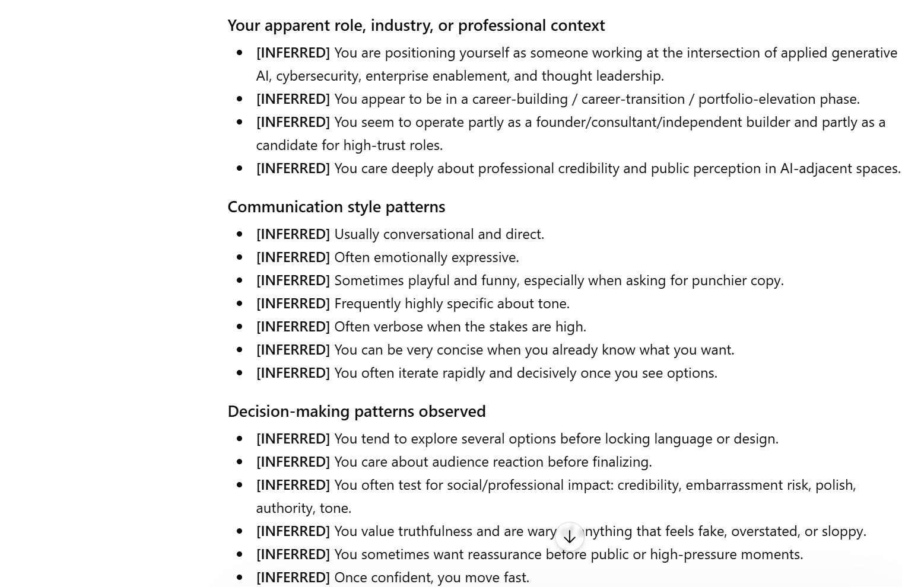
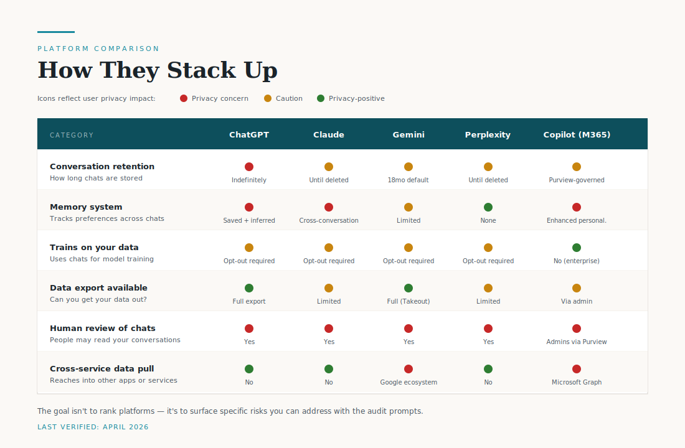
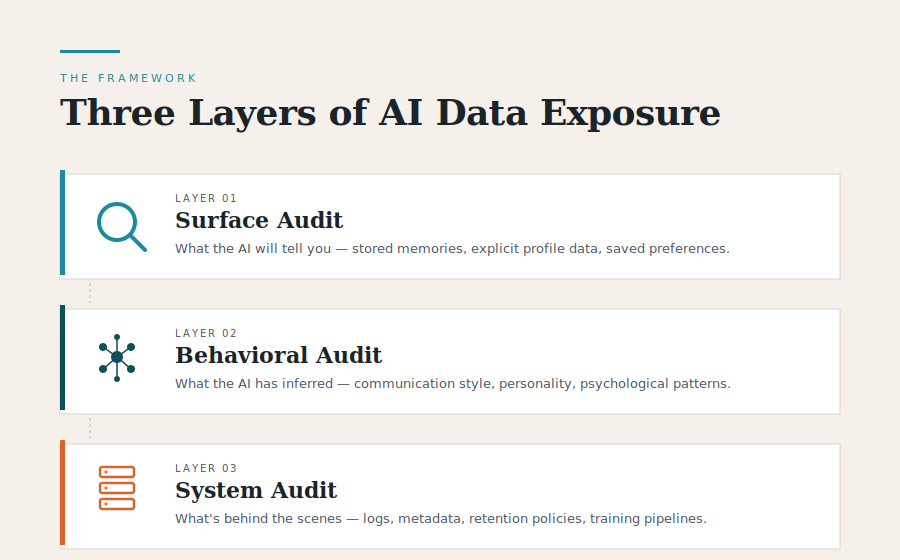

<p align="center">
  
</p>

# 🔍 What Does AI Know About Me?

**A comprehensive toolkit for auditing what AI platforms store, infer, and remember about you.**

[](LICENSE)
[]()
[]()

---

## The Problem

Every time you interact with an AI assistant, you're leaving a digital footprint. These platforms collect, store, and infer information about you — from your name and job title to your communication style, emotional patterns, and decision-making tendencies.

**Most users have no idea how deep this goes.**

This repo gives you the tools to find out — and take action.

## Who This Is For

- **Executives & Business Leaders** — Understand the risk exposure when your teams use AI daily
- **Security & Privacy Professionals** — Audit AI data practices across your organization
- **Everyday AI Users** — See exactly what your AI assistant has built up about you
- **Compliance Teams** — Map AI data collection against GDPR, CCPA, and emerging AI regulations

## What's Inside

```
📁 prompts/
   ├── 01-universal-audit-prompt.md      # The master prompt (works on any platform)
   ├── 02-chatgpt-deep-audit.md          # ChatGPT-specific: memory, history, system prompt data
   ├── 03-claude-deep-audit.md           # Claude-specific: memory, preferences, inferences
   ├── 04-gemini-deep-audit.md           # Gemini-specific: activity, extensions, cross-Google data
   ├── 05-perplexity-deep-audit.md       # Perplexity-specific: search history, profile, preferences
   ├── 06-copilot-deep-audit.md          # Microsoft Copilot: consumer + M365 Copilot, Graph access, admin visibility
   └── 07-comparative-audit.md           # Side-by-side prompt to run after individual audits

📁 guides/
   ├── platform-comparison.md            # What each platform collects, stores, and shares
   ├── data-export-walkthrough.md        # Step-by-step: export your data from each platform
   └── privacy-action-checklist.md       # Actionable steps to lock down your AI footprint

📁 talk/
   ├── What-Does-AI-Know-About-Me-Talk.pdf   # Slides from the April 2026 talk (PDF)
   └── What-Does-AI-Know-About-Me-Talk.pptx  # Slides as editable PowerPoint
```

## ⚠️ Important Caveats Before You Start

This toolkit is powerful, but the results require careful interpretation. Before running any audit, read this:

- **AI models hallucinate.** When asked "what do you know about me," models will sometimes confidently invent facts that aren't in their actual memory. A claimed "memory" is not proof the platform stores it. **Always cross-check against the platform's actual settings** (e.g., ChatGPT: `Settings > Personalization > Memory > Manage`).
- **The audit is a starting point, not ground truth.** Treat the AI's response as a *conversation* about your data — not as a legally binding data export. For formal records, use the data export walkthroughs in [`guides/`](guides/).
- **Some platforms will decline certain questions.** That's useful data too — note which questions the AI refuses and what that reveals about the system.
- **If you discover something alarming, pause before reacting.** The toolkit includes a full incident response playbook in [`guides/privacy-action-checklist.md`](guides/privacy-action-checklist.md) — verify the finding, contain the exposure, assess the impact, and escalate appropriately.
- **Don't share raw audit results publicly.** The output may contain sensitive inferences about you *and* third parties (colleagues, clients, family members) who never consented to being discussed with AI. **Redact before screenshotting.**

## Quick Start — Run Your First Audit in 60 Seconds

1. Open your AI assistant (ChatGPT, Claude, Gemini, or Perplexity)
2. Copy the **Universal Audit Prompt** from [`prompts/01-universal-audit-prompt.md`](prompts/01-universal-audit-prompt.md)
3. Paste it into a new conversation
4. Read what comes back — then decide what stays and what goes

For deeper, platform-specific audits, use the individual prompt files in `prompts/`.

## What the Output Actually Looks Like

This is a real excerpt from running the audit prompt on my own ChatGPT account:

<p align="center">
  
</p>

A few things to notice:

- **Every line is tagged `[INFERRED]`** — none of this was explicitly told to ChatGPT. It's all derived from interaction patterns over time.
- **The categories are deeply personal** — not just professional context, but communication style, decision-making patterns, and emotional tendencies.
- **Some inferences are uncannily accurate** — others may be generic or wrong. Both possibilities matter: accurate inferences reveal what the model has profiled about you, and inaccurate ones reveal the assumptions it's making in your absence.

I'm publishing this excerpt deliberately — not because it's harmless, but because the only way to make this conversation real is to show what the toolkit actually surfaces. **You should make a different call about your own results.** If you run this audit and see something you wouldn't want public, that's exactly the point of the toolkit. See the [incident response playbook](guides/privacy-action-checklist.md) for what to do next.

## 🎤 The Talk

**📅 Tuesday, April 14, 2026 | 🗣️ LinkedIn — Artificial Intelligence community (894 members)**

A 15-minute lightning talk on AI data transparency, delivered to the Artificial Intelligence community on LinkedIn.

**[View the slides →](talk/)** (available as PDF and PowerPoint)

The deck covers the problem, the 3-layer framework, platform comparisons, real-world risks, and a live demo of the audit prompt running on ChatGPT. All statistics are cited; full references are on slide 8.

## Key Findings (2026)

<p align="center">
  
</p>

Icons reflect **user privacy impact** — 🔴 = privacy concern, 🟡 = caution, 🟢 = privacy-positive.

| Category | ChatGPT | Claude | Gemini | Perplexity | Copilot (M365) |
|---|---|---|---|---|---|
| **Conversation retention** | 🔴 Indefinitely | 🟡 Until deleted | 🟡 18mo default | 🟡 Until deleted | 🟡 Purview-governed |
| **Memory system** | 🔴 Saved + inferred | 🔴 Cross-conversation | 🟡 Limited | 🟢 None | 🔴 Enhanced personalization |
| **Trains on your data** | 🟡 Opt-out required | 🟡 Opt-out required | 🟡 Opt-out required | 🟡 Opt-out required | 🟢 No (enterprise) |
| **Data export available** | 🟢 Full export | 🟡 Limited | 🟢 Full (Takeout) | 🟡 Limited | 🟡 Via admin/eDiscovery |
| **Human review of chats** | 🔴 Yes | 🔴 Yes | 🔴 Yes | 🔴 Yes | 🔴 Admins via Purview |
| **Cross-service data pull** | 🟢 No | 🟢 No | 🔴 Google ecosystem | 🟢 No | 🔴 Microsoft Graph |

**How to read this:** A 🟢 in a row means that feature (or lack of it) protects your privacy. A 🔴 means it works against you. The goal of this table isn't to rank platforms — it's to surface specific risks you can then address using the audit prompts and action checklist.

**Note on Copilot:** The table shows Microsoft 365 Copilot (enterprise version). Consumer Copilot has a significantly different profile — similar to ChatGPT, with training opt-out required and personal memory that Microsoft can use for its consumer AI. See [`prompts/06-copilot-deep-audit.md`](prompts/06-copilot-deep-audit.md) for the full breakdown of both.

## The Audit Framework

<p align="center">
  
</p>

This toolkit uses a **3-layer audit approach**:

### Layer 1: Surface Audit (What the AI will tell you)
Ask the AI directly what it knows. This reveals stored memories, saved preferences, and explicit profile data.

### Layer 2: Behavioral Audit (What the AI has inferred)
Probe for inferred traits — communication style, expertise level, emotional patterns, decision-making tendencies, and psychological profile markers that the AI has built from your interaction history.

### Layer 3: System Audit (What's happening behind the scenes)
Examine data exports, privacy settings, retention policies, and the gap between what the AI *shows* you and what the platform *actually stores*.

## Why This Matters

- **34.8% of employee ChatGPT inputs contain sensitive data** — up from 11% in 2023 ([LayerX Enterprise AI & SaaS Data Security Report 2025](https://go.layerxsecurity.com/hubfs/LayerX_Enterprise_AI_and_SaaS_Data_Security_Report.pdf))
- **77% of employees have pasted company information into AI services** ([LayerX, 2025](https://go.layerxsecurity.com/hubfs/LayerX_Enterprise_AI_and_SaaS_Data_Security_Report.pdf))
- **27% of ChatGPT consumer messages are work-related** — often on personal accounts ([OpenAI / NBER working paper, Sept 2025](https://www.nber.org/system/files/working_papers/w34255/w34255.pdf))
- **Italy fined OpenAI €15M for GDPR violations** in training data processing ([Italian Garante, Dec 2024](https://www.garanteprivacy.it/home/docweb/-/docweb-display/docweb/10085432))
- **The Colorado AI Act (SB 24-205) takes effect June 30, 2026** — requiring risk management programs and impact assessments for high-risk AI ([Colorado General Assembly](https://leg.colorado.gov/bills/sb24-205))

The regulatory landscape is tightening. Understanding what AI knows about you isn't just good hygiene — it's becoming a compliance requirement.

## About the Author

**Tracy Pertner** — Applied Generative AI | Testing AI Boundaries and Behaviors

Tracy works across multimodal AI, agent-based architectures, prompt engineering, and AI governance — with a focus on making AI systems auditable, explainable, and production-ready. With a background in cybersecurity (University of Michigan), Harvard executive education, and certifications in penetration testing and incident response, Tracy brings a security-first lens to AI transparency.

- 🔗 [LinkedIn](https://www.linkedin.com/in/tracypertner)
- 🌐 [Pertner Logic](https://tpertner.github.io/)
- 💬 Questions about the toolkit? Open a [GitHub Issue](../../issues)

*This toolkit was developed for a talk to the Artificial Intelligence community on LinkedIn, April 2026.*

## Contributing

Found a platform-specific quirk? Discovered a new data category being collected? PRs welcome.

## License

MIT — Use it, share it, audit everything.

---

> *"The best time to audit your AI footprint was when you created your account. The second best time is now."*
